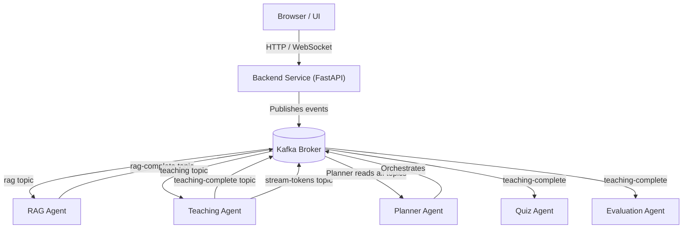
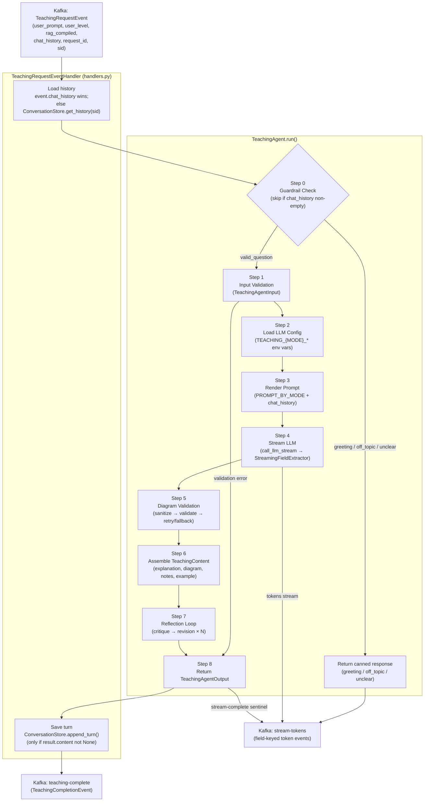

# Teaching Agent — Project Report

**Branch**: `002-build-teaching-agent` | **Date**: 2026-06-22
**Author**: Shalin Shah | **Status**: Fully Implemented

---

## 1. High-Level Overview

The Teaching Agent is the explanation-generation component of a multi-agent AI Tutor backend. It receives a learning request — a topic, a learner level, and optional RAG-compiled course material — and returns a structured, four-section explanation (Explanation, Diagram, Notes, Example) tailored to the requested depth.

**How it fits into the system:**

The overall backend is a Kafka-first, event-driven architecture. No agent calls another agent directly. The Planner Agent is the system orchestrator: it assembles the user's request, optionally enriches it with material from the RAG Agent, then publishes a `TeachingRequestEvent` to the `"teaching"` Kafka topic. The Teaching Agent worker consumes that event, runs the pipeline, and publishes results to two topics:

- `"teaching-complete"` — the complete structured response (`TeachingCompletionEvent`)
- `"stream-tokens"` — real-time field-keyed token events for progressive frontend rendering

Downstream consumers — the Quiz Agent and Evaluation Agent — read from `"teaching-complete"`. The Teaching Agent is unaware of them; the Planner owns routing.

**The Teaching Agent's contract is strictly defined:**
- **Input**: `TeachingRequestEvent` (via Kafka) with `user_prompt`, `user_level`, `rag_compiled`, `sid`, `request_id`, and optional `chat_history`
- **Output**: `TeachingCompletionEvent` carrying the complete raw markdown response, plus stream-token events for real-time delivery
- **Guarantee**: A completion event is always published — even on error. The Planner is never left waiting.

---

## 2. Key Features

### 2.1 Three-Mode Explanation Pipeline

Every request is processed through one of three mode-specific paths, selected by `user_level`:

| Mode | Audience | Explanation Structure | Diagram | Token Ceiling |
|---|---|---|---|---|
| `beginner` | No prior knowledge | 5-part: plain summary → analogy → step-by-step → diagram ref → key takeaways | **Required** — always non-null | `TEACHING_BEGINNER_MAX_TOKENS` (default 4096) |
| `intermediate` | Knows the basics | 4-part: definition → mechanics → Python code example → trade-offs | Optional — included when topic has structural complexity | `TEACHING_INTERMEDIATE_MAX_TOKENS` (default 4096) |
| `advanced` | Experienced practitioner | 5-part: formal definition → internals + complexity → edge cases → real-world implications → further exploration | Optional — only when diagram communicates more than prose | `TEACHING_ADVANCED_MAX_TOKENS` (default 4096) |

The mode is treated as authoritative: it is never inferred or modified from the topic. An invalid mode value returns `status: "error"` before any LLM call.

### 2.2 LLM Integration via LiteLLM

All LLM calls go through `teaching_agent/llm_client.py`, which wraps [LiteLLM](https://github.com/BerriAI/litellm). This makes the agent provider-agnostic — the same code runs against Groq, Anthropic, Google Gemini, OpenAI, or any self-hosted endpoint by changing environment variables, with no Python changes required.

Two call modes are supported:
- **`call_llm(messages, config)`** — synchronous, returns `(content, tokens_used)`. Used for guardrail classification, diagram retry, and reflection critique/revision calls.
- **`call_llm_stream(messages, config)`** — streaming, yields `(delta, tokens_used)` tuples. Used for the main explanation generation.

Per-mode LLM configuration is fully env-var driven:

| Variable | Notes |
|---|---|
| `TEACHING_MODEL` | Required shared fallback |
| `TEACHING_{MODE}_MODEL` | Per-mode model override |
| `TEACHING_{MODE}_MAX_TOKENS` | Per-mode token ceiling, default 4096 |
| `TEACHING_{MODE}_TEMPERATURE` | Per-mode temperature, default 0.7 |
| `TEACHING_{MODE}_EFFORT` | `low\|medium\|high` — maps to `output_config` for Claude 4.6 models only; silently ignored for all other providers |

### 2.3 Structured Markdown Output with Real-Time Streaming

The LLM is prompted to return markdown with bold section headers (`**Explanation**`, `**Diagram**`, `**Notes**`, `**Example**`). The `StreamingFieldExtractor` (`stream_parser.py`) processes the raw delta stream in real time:

- `explanation`, `notes`, and `example` — streamed token-by-token to the frontend via `"stream-tokens"` as they arrive
- `diagram` — buffered until the section is complete, then published as a single event (partial Mermaid syntax is never sent)
- A stream-complete sentinel `{"done": true, "tokens_used": N}` is always the last event on `"stream-tokens"`, including on error paths, so the frontend always receives an end signal

### 2.4 Mermaid Diagram Validation and Sanitization

Every diagram the LLM generates is processed through two layers before it reaches the frontend:

1. **Sanitization** (`sanitize_mermaid_labels` in `helpers.py`): Auto-wraps unquoted Mermaid node labels containing special characters (`:`, `()`, `{}`, `#`, `%`, `÷`, `×`, `≤`, `≥`, `≠`) in double quotes. Already-quoted labels are left unchanged. Applied on all diagram paths: initial generation, beginner retry, and reflection revision.

2. **Structural validation** (`validate_mermaid` in `validators.py`): Regex-based check for a recognized diagram header (`graph TD`, `graph LR`, `flowchart`, `sequenceDiagram`) and at least one content segment. Invalid diagrams are never returned.

**Beginner-mode fallback**: Because beginner mode requires a non-null diagram (FR-005), validation failure triggers one retry LLM call. If the retry also fails, a minimal valid fallback diagram is substituted rather than returning null.

**Intermediate/advanced modes**: Validation failure simply sets `diagram` to null — the explanation proceeds without one.

### 2.5 Kafka Integration

The Teaching Agent follows the same three-file Kafka structure as the RAG Agent:

| File | Role |
|---|---|
| `kafka.py` | Protocol types (`KafkaConsumerProtocol`, `KafkaProducerProtocol`), factory functions, topic-scoped publish helpers |
| `handlers.py` | `TeachingRequestEventHandler` — maps Kafka event fields to `agent.run()` args, loads/saves session history via `ConversationStore`, builds completion event, publishes results. Zero Kafka I/O (all injectable). |
| `session_memory.py` | `ConversationStore` — bounded, TTL-expiring per-`sid` in-process chat-history store. Thread-safe. Injectable in tests. |
| `worker.py` | `TeachingWorker` — owns consumer/producer lifecycle; runs poll loop in a daemon thread. `start()` / `stop()` / `get_state()` interface. Startup topic-presence check against `get_teaching_topic_names()`. |

Topic registry in `project/topics.py`:
- `PlannerTopics.TEACHING = "teaching"` — inbound (Planner-owned)
- `TeachingTopics.TEACHING_COMPLETE = "teaching-complete"` — outbound

Both topics are included in `get_all_topic_names()`, so the backend service bootstraps them at startup.

### 2.6 Multi-Turn Conversation Support

Multi-turn is handled at two layers: the core pipeline (`agent.py`) and the handler (`handlers.py`).

**Core pipeline (`agent.py`)**: The `chat_history` field on `TeachingAgentInput` carries prior conversation turns (oldest→newest, `{"role", "content"}` pairs, current query excluded). The agent prepends them to the LLM message list ahead of the current structured prompt:

```python
messages = [*chat_history, {"role": "user", "content": structured_prompt}]
```

Every turn — first query and follow-up alike — runs the same 4-section pipeline and returns the same structured output. An empty `chat_history` (the default) produces behavior identical to the single-turn pipeline.

**In-process `ConversationStore` (`session_memory.py`)**: The handler now owns a `ConversationStore` instance that accumulates conversation history keyed by the Socket.IO session ID (`sid`). This means multi-turn works without any change to the upstream contract — the Planner does not need to supply `chat_history`.

History loading priority in `handlers.py`:
1. If `event.chat_history` is non-empty (explicitly provided by the Planner or a test), use it — this always wins.
2. Otherwise, call `store.get_history(sid)` to retrieve prior turns from the in-process store.

After each request, `store.append_turn(sid, user_prompt, raw_markdown)` persists the exchange — but **only when the result was a real teaching answer** (`result.content is not None`). Guardrail canned responses and error responses are never stored, so a first genuine question following a greeting still goes through guardrail classification.

**Store bounds** (both configurable via env var):

| Env var | Default | Effect |
|---|---|---|
| `TEACHING_MAX_HISTORY_MESSAGES` | `6` | Max messages kept per session (~3 back-and-forth exchanges). `0` disables memory entirely. |
| `TEACHING_SESSION_TTL_SECONDS` | `300` | Idle session lifetime in seconds (5 min). An expired session is dropped and the next request starts fresh. |

The store is thread-safe (uses a `threading.Lock`) and injectable in tests so each test constructs its own isolated store.

### 2.7 Guardrail Classification

Before the main pipeline runs, a lightweight LLM classification call intercepts non-learning inputs. The `GuardrailClassifier` (`guardrail.py`) uses `GUARDRAIL_PROMPT` to classify the user message into one of four categories:

| Category | Action |
|---|---|
| `greeting` | Returns canned welcome message; main pipeline skipped |
| `off_topic` | Returns canned redirect message; main pipeline skipped |
| `unclear` | Returns canned clarification request; main pipeline skipped |
| `valid_question` | Falls through to the full pipeline |

**Guardrail skip conditions**: The guardrail is bypassed entirely when `chat_history` is non-empty — whether that history came from the explicit `event.chat_history` field or was loaded from `ConversationStore` — or when `TEACHING_GUARDRAIL_ENABLED=false`.

**Fail-open**: Any exception or malformed JSON response from the guardrail LLM call returns `"valid_question"`, ensuring a learner is never silently dropped.

The guardrail uses a dedicated fast model (`TEACHING_GUARDRAIL_MODEL`, fallback to `TEACHING_MODEL`) with a low token ceiling (128 tokens) since the response is always a short JSON object.

### 2.8 Reflection Loop (Self-Critique and Revision)

After initial generation, the agent runs N critique-revision cycles before returning the final output. Each cycle:
1. **Critique call** — `REFLECTION_PROMPT_BY_MODE` prompt analyzes the current output and returns a `ReflectionCritique` JSON (`quality_score`, `issues`, `revision_instructions`)
2. **Revision call** — `REVISION_PROMPT_BY_MODE` prompt receives the current output plus the critique's `revision_instructions` and produces an improved version

Controlled by `TEACHING_MAX_REFLECTION_ITERATIONS` (default 1; `0` disables entirely and restores single-pass behavior). Per-mode override via `TEACHING_{MODE}_MAX_REFLECTION_ITERATIONS`.

Any failure in critique or revision (exception, unparseable JSON) breaks the loop and returns the best available content — `status` remains `"ok"`. Reflection is transparent to Kafka consumers: `TeachingCompletionEvent` is published exactly once, after all cycles complete.

`metadata.tokens_used` reports the sum of completion tokens across all LLM calls in the request lifecycle (generation + all critique + all revision calls). `metadata.reflection_iterations` counts only fully completed cycles.

### 2.9 RAG Context Integration

The `context` field (mapped from `rag_compiled` in the Kafka event) carries study material compiled by the RAG Agent from the user's course documents. All three mode prompts label it as `"Reference material (compiled from course documents):"` and include an explicit priority instruction:

> *When reference material is provided above, use it as your PRIMARY source. Ground your explanation in that content. Only draw on general knowledge where the reference material is silent or incomplete.*

When `context` is empty, the agent generates from general knowledge. The agent truncates `context` to 4000 characters before dispatch to prevent an oversized RAG payload from crowding out the generated explanation.

### 2.10 Schema-Safe Error Handling

All failure paths return a schema-valid `TeachingAgentOutput` with `status: "error"` and `content: None`. No unhandled exceptions propagate to the caller. This includes: invalid input, LLM call failure, empty LLM response, unparseable markdown, and diagram validation failure. A stream-complete sentinel is always published so the frontend always receives a terminating signal.

### 2.11 Example Verbosity Constraint (FR-051)

All three mode prompts include an explicit rule preventing the LLM from choosing large input values in the `**Example**` section that would generate exhaustive computation traces (e.g., `fibonacci(50)`) and consume the full token ceiling:

> *In the **Example** section, use small, illustrative input values (e.g. n ≤ 10 for recursive algorithms, short strings for string operations). Never show a full computation trace for a large input — demonstrate the concept, not the arithmetic.*

---

## 3. Architecture

### 3.1 System-Level Diagram



### 3.2 Teaching Agent Internal Pipeline



---

## 4. Known Limitations and Not-Yet-Implemented Items

### 4.1 Mermaid Validation is Structural, Not Semantic

`validate_mermaid()` performs a regex-based structural check (recognized header + at least one content segment). A diagram that is structurally valid but semantically broken (e.g., malformed edge syntax that would cause a renderer error) can pass this check. A full Mermaid parser is deferred to a future iteration. The structural check is sufficient to prevent the most common failure modes from reaching the renderer.

### 4.2 No Planner Agent Yet

The Planner Agent (`planner_agent/`) is specified (specs/000) but not yet implemented. During development and testing, `TeachingRequestEvent` payloads are published manually or via the e2e smoke test (`teaching_agent/tests/e2e_smoke.py`). When the Planner is built, it will own:
- Assembling `TeachingRequestEvent` from the user's WebSocket message
- Calling the RAG Agent to populate `rag_compiled`
- Managing and truncating `chat_history` across turns

### 4.3 Conversation Store is Process-Local (No Persistence Across Restarts)

`ConversationStore` lives in memory inside the worker process. If the worker restarts, all in-flight session histories are lost and users start fresh on their next request. This is an accepted trade-off for a short-session tutoring product where sessions expire after 5 minutes of idle time anyway. A persistent store (Redis, database) would be needed for longer-lived or cross-process session continuity, but is not in scope.

### 4.4 No Cross-Worker History Sharing

If the Teaching Agent is scaled horizontally (multiple worker processes), each process owns an independent `ConversationStore`. Requests from the same `sid` hitting different workers will not see each other's history. Sticky routing (routing all requests for a given `sid` to the same worker) or an external shared store would be required for multi-process deployments.

### 4.5 Reflection Quality Is Probabilistic

The reflection loop (Step 7) is expected to improve output quality in ≥ 80% of runs on a structured rubric (spec.md SC-011), but it is a probabilistic guarantee. A critique-revision cycle may occasionally produce a lateral move rather than an improvement. The automated test suite verifies control flow and token accounting; the quality rubric validation (tasks.md T046) is a manual step requiring real LLM calls.

### 4.6 tasks.md Status Tracking Lags Behind Implementation

The tasks.md file shows Phase 6 (Guardrail) tasks T065–T072 and Phase 7 tasks T073–T074 as `[ ]` (not started). In practice, all of these are implemented in the codebase. The task tracking was not updated after implementation. This is a documentation gap only and does not affect the running code.

### 4.7 Pre-Existing Test Failure

One test in `test_kafka_integration.py` — `test_progress_updates_emitted_for_teaching_steps_to_chat` — expects the progress message `"Generating Mermaid diagram."` but `stream_parser.py` emits `"Generating diagram."` (lowercase field name, no "Mermaid" prefix). This is a test/implementation mismatch introduced in an earlier phase and has not yet been resolved.

---

*This report is generated from the actual code and specification artifacts in `specs/002-teaching-agent/`. All features described in §2 are present in the deployed `teaching_agent/` module as of the date above.*
