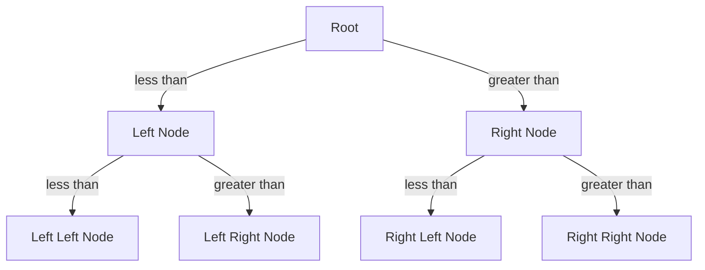

**Explanation**
1. A Binary Search Tree is a way to organize information, like a special kind of filing system, that helps us find things quickly.
2. Imagine you're looking for a book in a library where all the books are arranged alphabetically, and each shelf has a sign saying what letters are on that shelf - this is similar to how a Binary Search Tree works.
3. It matters because it helps computers find and organize large amounts of data efficiently, which is important for many applications like databases and file systems.
4. Here's how it works: we start with a 'root' (like the first shelf in the library), and each piece of information (or 'node') has two branches - one for things that come before it, and one for things that come after it, and we keep dividing like this until we find what we're looking for.
5. A common mistake beginners make is thinking that every tree is a Binary Search Tree, but it's not - a Binary Search Tree has to follow specific rules about how the information is organized.

**Diagram**

**Notes**
* A Binary Search Tree is used for efficient data retrieval
* Each node has at most two children (left and right)
* The left subtree of a node contains only values less than the node's value
* The right subtree of a node contains only values greater than the node's value

**Example**
Let's say we want to find the number 7 in a Binary Search Tree that contains the numbers 3, 5, 7, 9, and 11. We start at the root (let's say it's 7), and since 7 is what we're looking for, we're done. But if the root was 5, we would look at the right branch (since 7 is greater than 5), and then we would find 7. This way, we can quickly find what we're looking for by following the branches.